# RGTP Architecture

**Version:** 1.0  
**Date:** May 26, 2026

This document describes the architecture and data flow of the Red Giant Transport Protocol (RGTP) using Mermaid diagrams.

---

## 1. Layered Architecture

The library is organized into seven horizontal layers. Each layer depends only on layers below it.

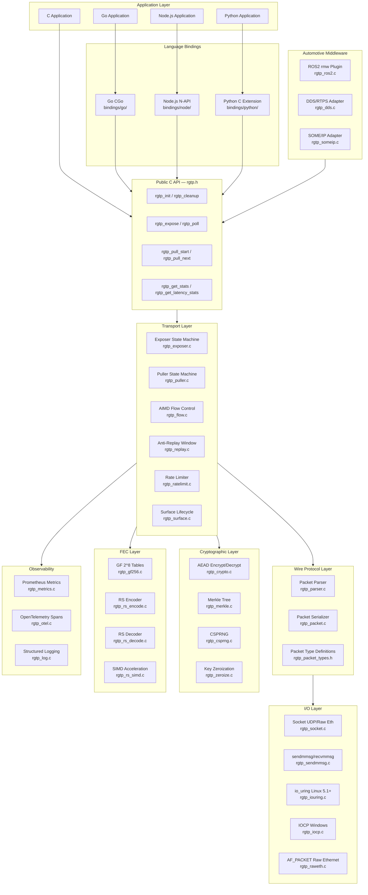

---

## 2. Exposer Data Flow

Shows what happens from the moment `rgtp_expose()` is called until a chunk is served to a puller.

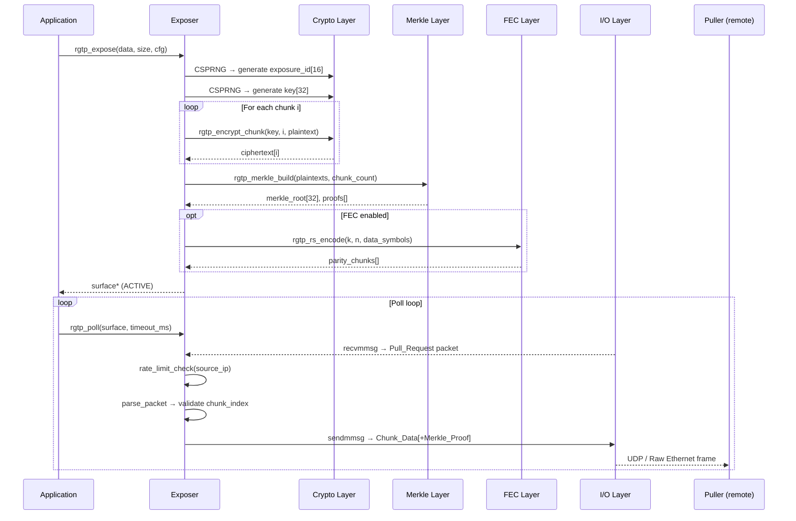

---

## 3. Puller Data Flow

Shows the full pull lifecycle from connection to chunk delivery.

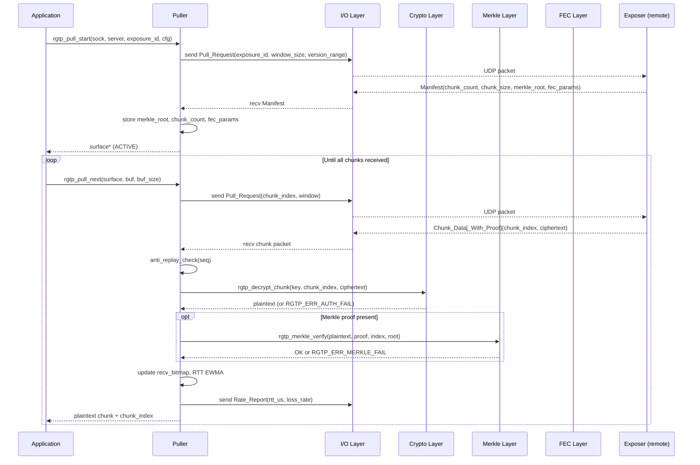

---

## 4. Packet Flow and Wire Protocol

Shows all 8 packet types and their direction between exposer and puller.

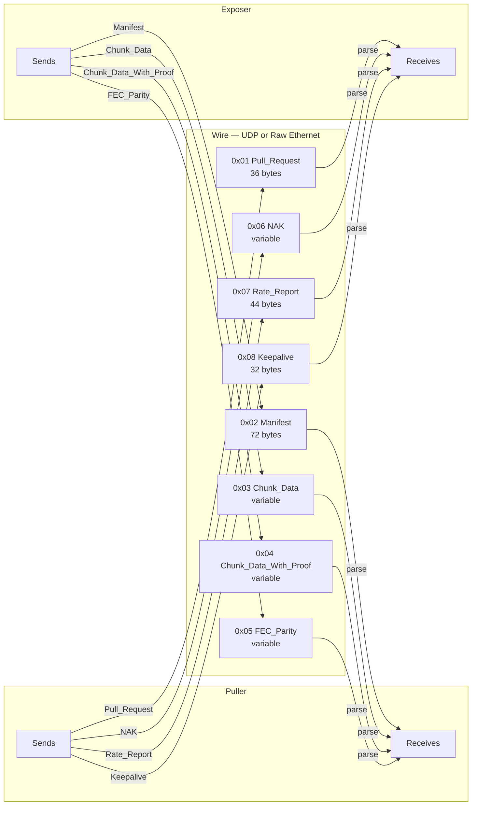

---

## 5. Cryptographic Pipeline

Shows how a single chunk moves through the crypto subsystem on both sides.

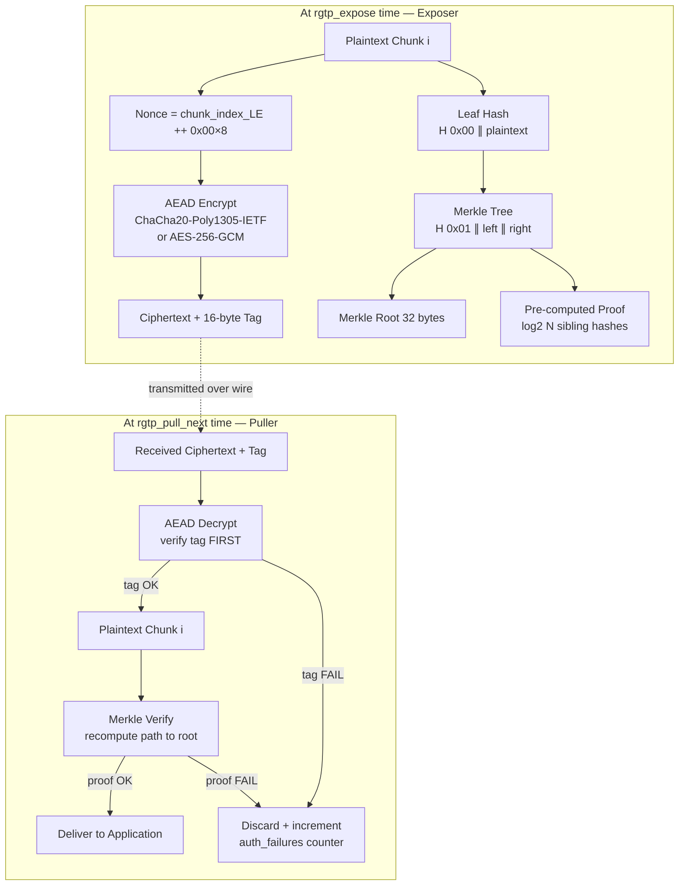

---

## 6. Flow and Congestion Control

Shows the AIMD feedback loop between puller and exposer.

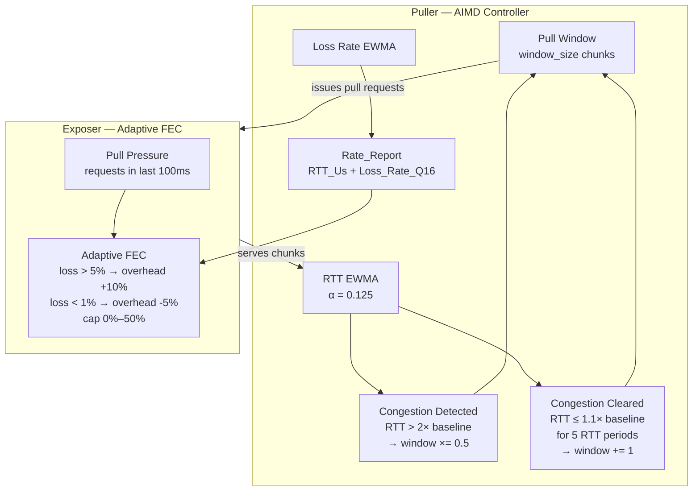

---

## 7. I/O Backend Selection

Shows how the I/O backend is chosen at socket creation time.

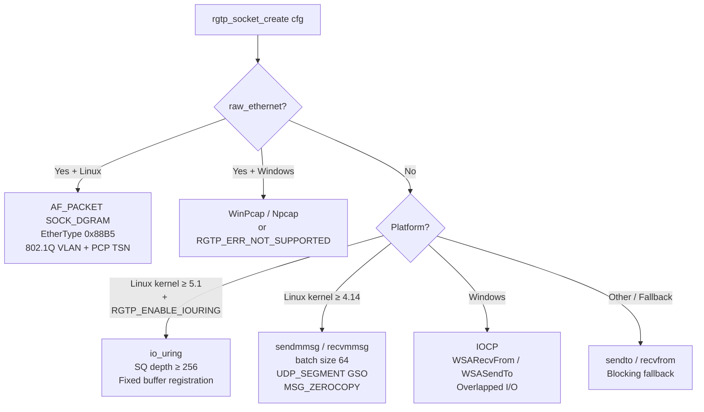

---

## 8. FEC Encode / Decode Pipeline

Shows how Reed-Solomon FEC protects a block of chunks.

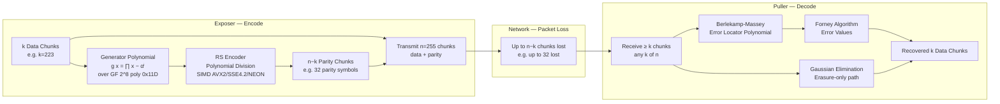

---

## 9. Automotive Middleware Integration

Shows how RGTP integrates with AV middleware stacks.

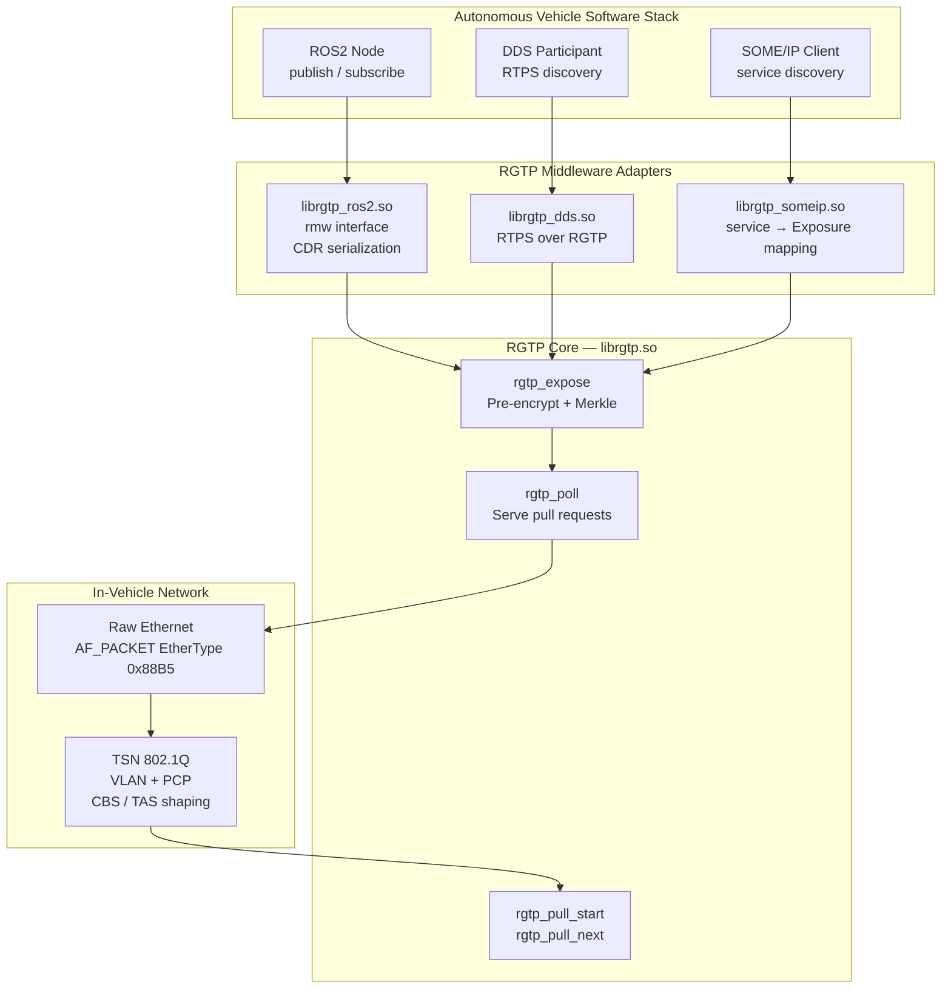

---

## 10. Observability Pipeline

Shows how metrics, traces, and logs flow out of the library.

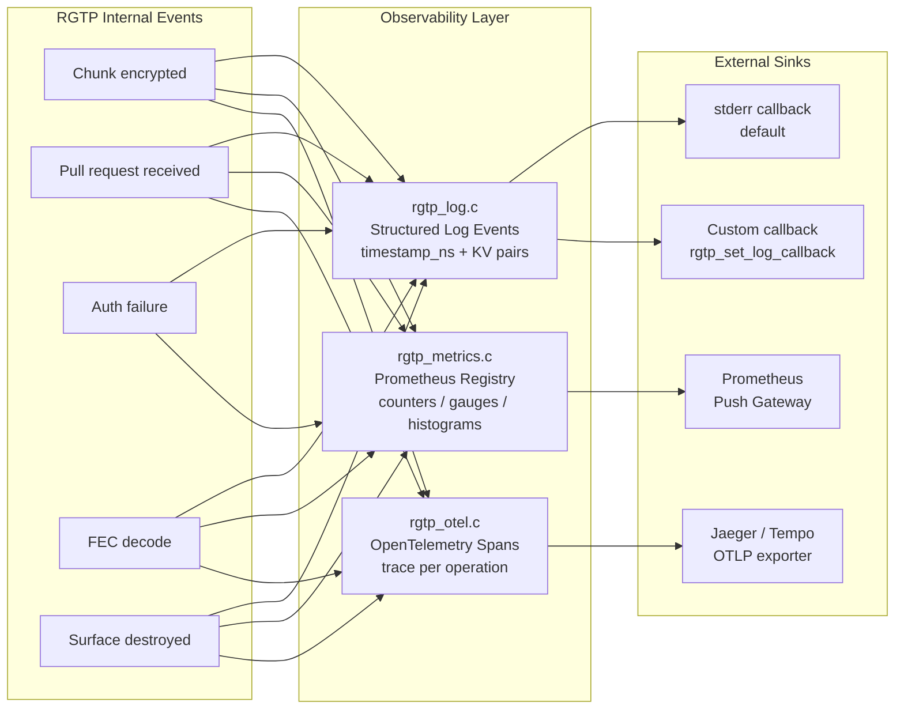

---

## 11. State Machines

### Exposer State Machine

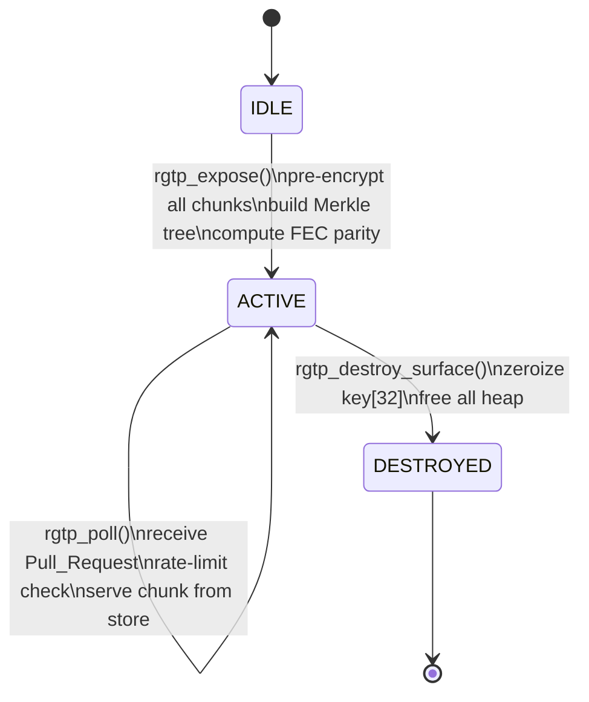

### Puller State Machine

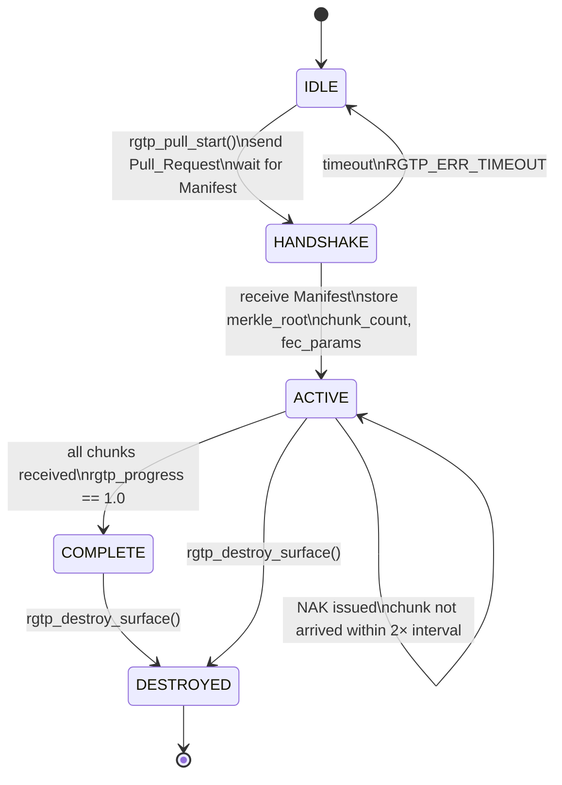

---

## 12. Module Dependency Graph

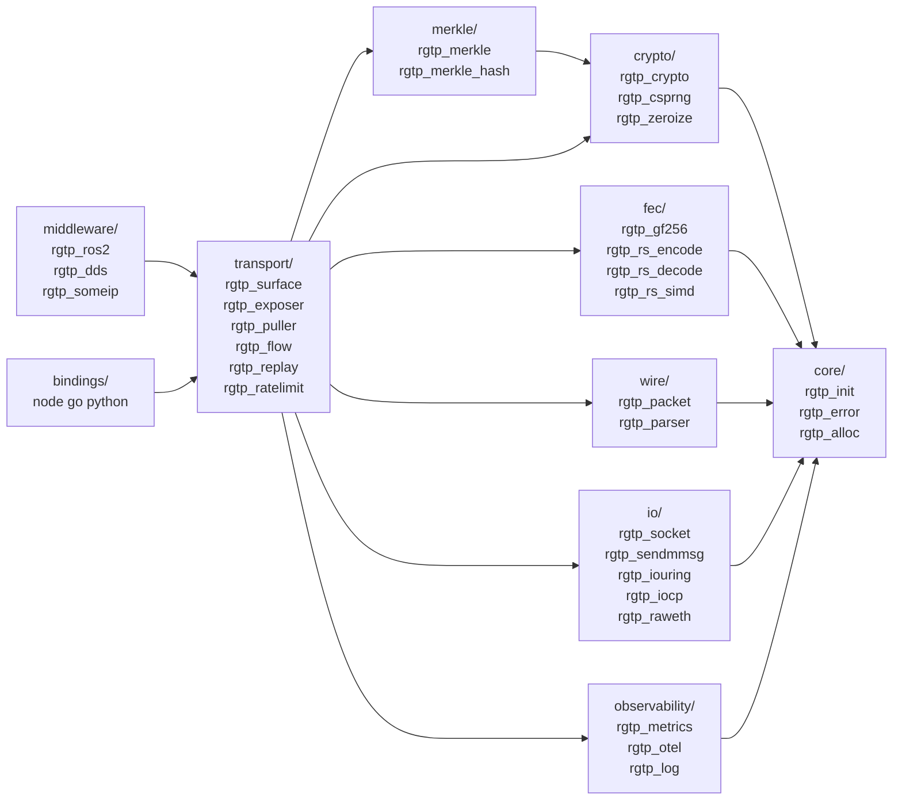
